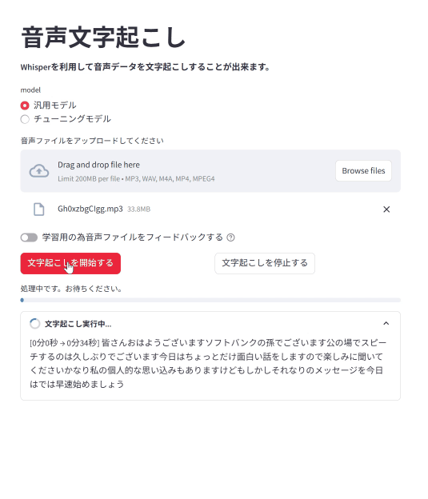

# Demo



# Description

This app enables speech-to-text transcription.  
You can either set up your own transcribe server or use OpenAI's API to call Whisper for transcription.  

このアプリは文字起こしをすることが出来ます。  
文字起こしは自身でサーバーを建てるか、OpenAIのAPIを使ってWhisperを呼び出すこともできます。  

# How to use

For details on usage and code, please refer to the following links.(Japanese)

使い方、コードの詳細は以下のリンクから確認できます。

[Streamlit＋Flask＋Whisperで社内オンプレ文字起こしサーバーを構築(同期処理)](https://zenn.dev/tsuzukia/articles/05162d92997634)

[Streamlit＋FastAPI＋Whisperで社内オンプレ文字起こしサーバーを構築(非同期処理)](https://zenn.dev/tsuzukia/articles/2ec8a1fce80b1a)

# Installation

```python
pip install -r requirements.txt
```

# Usage

```python
streamlit run app.py
python server.py
```

# Author

* tsuzukia21
* Twitter : [https://twitter.com/tsuzukia_prgm](https://twitter.com/tsuzukia_prgm)
* zenn : https://zenn.dev/tsuzukia

Thank you!
